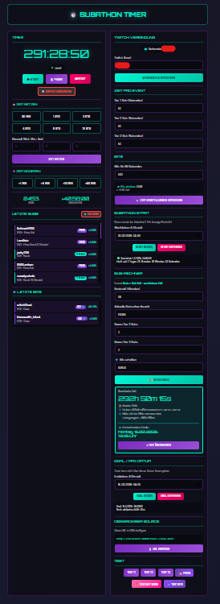

# 🎮 Subathon Timer für Twitch

Ein professioneller Subathon-Timer für deinen Twitch-Stream mit automatischer Zeit-Hinzufügung bei Subs, Gift-Bombs und Bits!



## ✨ Features

- 🎨 **8 Timer-Designs** - Wähle aus verschiedenen Styles (Clean, Neon, Fire, Gold, Retro, Rainbow, Purple, Minimal)
- 📺 **OBS-Ready** - Transparenter Hintergrund für Browser Sources
- 🔄 **Auto-Sync** - Timer speichert sich automatisch (überlebt Browser-Neustarts)
- 🎉 **Sub-Animationen** - Coole Popup-Effekte bei neuen Subs
- 💣 **Gift-Bomb Support** - Erkennt und zählt Gift-Bombs korrekt
- 💎 **Bits-Unterstützung** - Bits werden automatisch in Zeit umgerechnet
- ⚡ **High-Performance** - Queue-System verarbeitet 100+ Subs/Sekunde
- 🎯 **Goal-Datum** - Timer kann ein maximales Enddatum haben
- 🧮 **Sub-Rechner** - Berechne Timer-Zeit basierend auf Sub-Anzahl
- 👑 **Prime-Erkennung** - Prime Subs werden separat angezeigt
- 📊 **Live-Statistiken** - Sub-Liste, Bits-Zähler, hinzugefügte Zeit

## 🚀 Schnellstart

### 1. Server starten

Der Timer benötigt einen lokalen Server. Starte einen der folgenden:

**Mit Node.js:**
```bash
node server.js
```

**Mit Python:**
```bash
python server.py
```

Der Server startet auf `http://localhost:8080`

### 2. Kontrollzentrum öffnen

Öffne im Browser:
```
http://localhost:8080/
```
oder direkt:
```
http://localhost:8080/control.html
```

### 3. Twitch-Kanal eintragen

1. Gib deinen Twitch-Kanalnamen ein
2. Stelle die Zeit pro Sub-Tier ein
3. Klicke "Verbinden & Speichern"


### 4. In OBS einbinden

1. Füge eine neue **Browser Source** hinzu
2. URL: `http://localhost:8080/timer-clean.html` (oder ein anderes Design)
3. Breite: **800**, Höhe: **200**
4. ✅ "Custom CSS" leer lassen (Hintergrund ist bereits transparent)


## 🎨 Timer-Designs

| Design | URL | Beschreibung |
|--------|-----|--------------|
| **Clean** | `/timer-clean.html` | Minimalistisch mit Glow-Effekt (empfohlen) |
| **Neon** | `/timer-neon.html` | Cyberpunk Neon-Style |
| **Fire** | `/timer-fire.html` | Feuriger Gradient |
| **Gold** | `/timer-gold.html` | Elegantes Gold |
| **Purple** | `/timer-purple.html` | Twitch-lila Theme |
| **Retro** | `/timer-retro.html` | 80er Retro-Wave |
| **Rainbow** | `/timer-rainbow.html` | Animierter Regenbogen |
| **Minimal** | `/timer-minimal.html` | Nur Zahlen, kein Styling |

## ⚙️ Konfiguration

### Zeit pro Event (Standard)

| Event | Zeit |
|-------|------|
| Tier 1 Sub / Prime | 60 Sekunden |
| Tier 2 Sub | 120 Sekunden |
| Tier 3 Sub | 300 Sekunden |
| Gift Sub | wie Tier 1 |
| 500 Bits | 60 Sekunden |

### Bits-System

Bits werden nach dem Schema **"X Bits = 60 Sekunden"** umgerechnet. Standard: 500 Bits = 60 Sekunden.

Beispiele:
- 100 Bits → 12 Sekunden
- 1000 Bits → 2 Minuten
- 5000 Bits → 10 Minuten

## 🎛️ Steuerung

### Über Kontrollzentrum

- **Timer-Kontrolle** - Start/Pause/Reset
- **Quick-Buttons** - Schnell Zeit setzen (30 Min, 1h, 2h, 4h, 8h, 12h)
- **Zeit addieren** - Manuell +1/+5/+10/+60 Minuten
- **Manuell** - Exakte Zeit eingeben (Stunden:Minuten:Sekunden)
- **Test-Buttons** - Subs, Gift-Bombs und Bits simulieren
- **Sub-Rechner** - Timer-Zeit basierend auf Sub-Anzahl berechnen
- **Goal-Datum** - Maximales Enddatum festlegen
- **Sub-Liste** - Zeigt die letzten 20 Subs/Bits an


### Sub-Rechner

Berechnet die Timer-Zeit mit der Formel:

```
Zeit = Basiszeit + Sub-Zeit + Bits-Zeit - verstrichene Zeit
```

1. Basiszeit eingeben (z.B. 24 Stunden)
2. Aktuelle Sub-Anzahl eingeben
3. Optional: Tier 2/3 Subs separat angeben
4. Optional: Erhaltene Bits eingeben
5. "Berechnen" klicken
6. Berechnete Zeit übernehmen


### Goal-Datum

Der Timer kann ein maximales Enddatum haben. Wenn das Goal erreicht ist:
- Werden keine neuen Subs/Bits mehr gezählt
- Zeigt der Timer eine goldene Farbe
- Wird im Kontrollzentrum angezeigt, wie viel Zeit noch addierbar ist

## 📁 Dateistruktur

```
twitch-timer/
├── server.js           # Node.js Sync-Server
├── server.py           # Python Sync-Server (Alternative)
├── control.html        # Kontrollzentrum
├── timer-data.json     # Gespeicherte Timer-Daten
│
├── Timer-Designs:
│   ├── timer.html          # Standard Timer
│   ├── timer-clean.html    # Clean Design (empfohlen)
│   ├── timer-neon.html     # Neon Cyberpunk
│   ├── timer-fire.html     # Fire Gradient
│   ├── timer-gold.html     # Gold Elegant
│   ├── timer-purple.html   # Twitch Purple
│   ├── timer-retro.html    # 80s Retro
│   ├── timer-rainbow.html  # Animated Rainbow
│   └── timer-minimal.html  # Minimal/Clean
│
├── JavaScript:
│   ├── app.js          # Haupt-App
│   ├── timer.js        # Timer-Logik
│   ├── twitch.js       # Twitch-Integration
│   └── tmi.min.js      # TMI.js Bibliothek
│
├── Styles:
│   └── styles.css      # Basis-Styling
│
└── README.md           # Diese Datei
```

## 🔧 Anpassungen

### Farben ändern

Jedes Timer-Design hat seine eigenen CSS-Variablen. In `timer-clean.html` z.B.:

```css
.time-value {
    color: #fff;
    text-shadow: 
        0 0 10px rgba(0, 245, 212, 0.8),
        0 0 30px rgba(0, 245, 212, 0.6);
}
```

### Warnung bei wenig Zeit

Standard: 5 Minuten (300 Sekunden). Der Timer wechselt dann zu einer Warnfarbe.

### Server-Port ändern

In `server.js` oder `server.py`:
```javascript
const PORT = 8080;  // Ändern nach Bedarf
```

## 🐛 Troubleshooting

### Timer zeigt sich nicht in OBS
- Prüfe ob der Server läuft (`node server.js` oder `python server.py`)
- Teste die URL im normalen Browser: `http://localhost:8080/timer-clean.html`
- In OBS: "Refresh browser when scene becomes active" aktivieren
- Prüfe ob Port 8080 nicht von anderer Software belegt ist

### Subs werden nicht erkannt
- Der Kanal muss exakt geschrieben sein (Kleinbuchstaben)
- TMI.js braucht einige Sekunden zum Verbinden
- Prüfe die Browser-Konsole auf Fehler (F12)
- Status "Verbunden" muss im Kontrollzentrum angezeigt werden

### Gift-Bombs werden doppelt gezählt
- Das System hat ein intelligentes Gift-Tracking
- Gift-Bombs (`submysterygift`) werden bevorzugt gezählt
- Einzelne `subgift` Events werden erst nach 20s Wartezeit gezählt

### Timer springt nach Browser-Neustart
- Der Timer speichert automatisch alle 10 Sekunden
- Bei Neustart wird verstrichene Zeit automatisch abgezogen
- Das ist gewollt für Crash-Recovery

### Server-Fehler "Port bereits belegt"
- Prüfe ob bereits ein Server läuft
- Ändere den Port in `server.js`/`server.py`
- Windows: `netstat -ano | findstr :8080` zeigt den Prozess

## 🔌 API-Endpunkte

Der Server bietet eine REST-API:

| Endpunkt | Methode | Beschreibung |
|----------|---------|--------------|
| `/api/timer` | GET | Timer-Daten abrufen |
| `/api/timer` | POST | Config aktualisieren |
| `/api/start` | POST | Timer starten |
| `/api/pause` | POST | Timer pausieren |
| `/api/reset` | POST | Timer zurücksetzen |
| `/api/fullreset` | POST | Alles zurücksetzen |
| `/api/settime` | POST | Zeit setzen |
| `/api/addtime` | POST | Zeit hinzufügen |
| `/api/setgoal` | POST | Goal-Datum setzen |
| `/api/addbits` | POST | Bits hinzufügen |
| `/api/resetlist` | POST | Sub-Liste leeren |

## 📜 Lizenz

Frei verwendbar für deinen Stream! 🎉

---

Made with 💜 für Twitch Streamer
